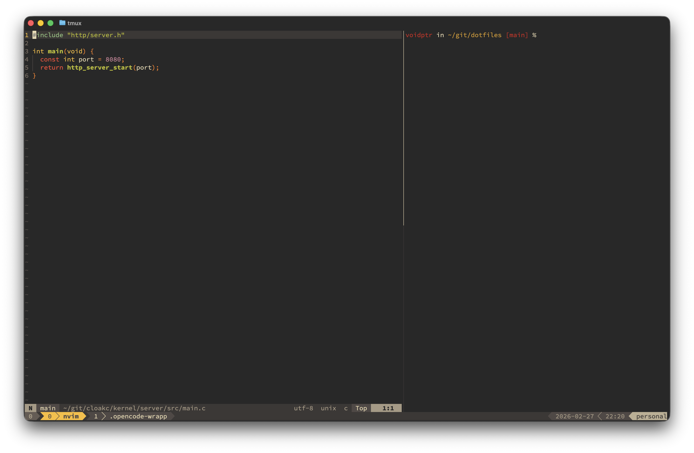

# dotfiles

Declarative system and user configuration using Nix flakes, nix-darwin, and Home Manager.



## What this repo manages

- macOS system config (`nix-darwin`) via `darwinConfigurations.personal`
- User programs and dotfiles (`home-manager`) via `homeManagerModules`
- Custom Neovim package (`packages.nvim`) built with `nixvim`

## Current module layout

- `modules/darwin/` -> `flake.darwinModules.*`
- `modules/hosts/<host>/` -> host composition + `flake.darwinConfigurations.*`
- `modules/programs/<category>/` -> `flake.homeManagerModules.*`
  - `modules/programs/terminal/` (ghostty, tmux, zsh)
  - `modules/programs/internet/` (firefox)
  - `modules/programs/` (shared HM modules like git, opencode)
- `modules/nix/` -> `flake.nixModules.*`
- `modules/packages/` -> package definitions (`perSystem.packages.*`)

## Key outputs

- `darwinConfigurations.personal`
- `homeManagerModules.*` (all user modules, including git/opencode/nvim)
- `packages.<system>.nvim`

## Bootstrap

Use the setup script:

```bash
./setup.sh
```

`setup.sh` will:

- install Determinate Nix (if `nix` is missing)
- set hostname to `personal`
  - macOS: `scutil --set HostName/LocalHostName/ComputerName`
  - Linux: `hostnamectl set-hostname` (if available)
- run system switch for `#personal`

## Manual rebuild

```bash
sudo darwin-rebuild switch --flake ~/git/dotfiles#personal
```

## Formatting

After any `.nix` change, run:

```bash
nix fmt .
```
