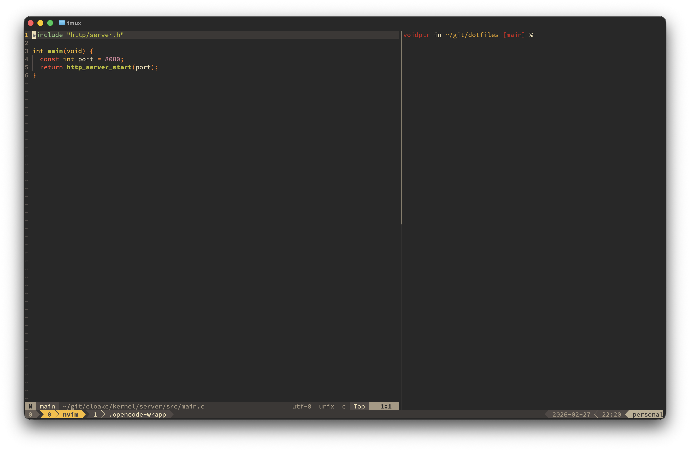

# dotfiles

Declarative system and user configuration using Nix flakes, nix-darwin, and Home Manager.



## What this repo manages

- macOS system config (`nix-darwin`) via `darwinConfigurations.personal`
- User programs and dotfiles (`home-manager`) via `homeManagerModules`
- Custom Neovim package (`packages.nvim`) built with `nixvim`

## Current module layout

- `modules/darwin/` -> `flake.darwinModules.*`
- `modules/hosts/<host>/` -> host composition + `flake.darwinConfigurations.*`
- `modules/programs/<category>/` -> `flake.homeManagerModules.*`
  - `modules/programs/terminal/` (ghostty, tmux, zsh)
  - `modules/programs/internet/` (firefox)
  - `modules/programs/security/` (sops-nix)
  - `modules/programs/` (shared HM modules like git and opencode)
- `modules/nix/` -> `flake.nixModules.*`
- `modules/packages/` -> package definitions (`perSystem.packages.*`)

## Key outputs

- `darwinConfigurations.personal`
- `homeManagerModules.*` (all user-facing HM modules)
- `packages.<system>.nvim`

## Bootstrap

Use the setup script:

```bash
./setup.sh
```

`setup.sh` will:

- install Determinate Nix (if `nix` is missing)
- set hostname to `personal`
  - macOS: `scutil --set HostName/LocalHostName/ComputerName`
  - Linux: `hostnamectl set-hostname` (if available)
- run system switch for `#personal`

## Manual rebuild

```bash
sudo darwin-rebuild switch --flake ~/git/dotfiles#personal
```

## Secrets (Home Manager + sops-nix)

- `sops-nix` is wired through `homeManagerModules.sops` for cross-platform secret handling.
- It is loaded as a shared Home Manager module (no per-host enable flag required).
- The default encrypted file path is `secrets/secrets.yaml`.
- The default age key file is `~/sops/age/keys.txt`.
- Git signing reads `sops.secrets.git-signing-key.path` when available.
- `nix develop` includes `sops`/`age` and exports `SOPS_AGE_KEY_FILE=~/sops/age/keys.txt`.

## Formatting

After any `.nix` change, run:

```bash
nix fmt .
```
